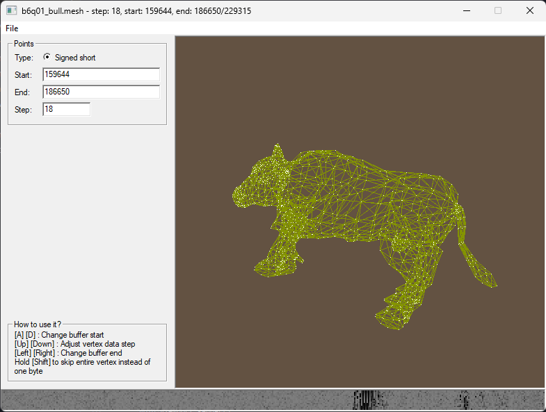

# Pathologic Game Research Project

Reverse-engineering Pathologic game resources and share my results in the public domain


> Pathologic is a property of [Ice-Pick Lodge](http://ice-pick.com/). All right belong to their respective owners.

## Goals
- [x] Extract .VFS files
- [ ] Create GUI utility to extract and pack .VFS files
- [ ] Reverse-enginere `.mesh` files structure
- [ ] Create a model viewer

## Geometry.vfs

Contains 3D models data.

### .mesh file structure (NOT COMPLETE)
```
struct {
    unsigned int unknown1;
    if (unknown1 == 0) {
        unsigned int unknown2;
    }
    unsigned int unknown3;
    unsigned int unknown4;
    unsigned char unknown5;
    unsigned char string_length;
    char texture_name[string_length];
    char probably_null_terminator_but_maybe_alpha_flag;
    unsigned int vertices_count;
    unsigned int indices_count;

    char unknown_chunk[89] // for inv_lemon.mesh
//    char unknown_chunk[89] // for inv_samopal.mesh
//    char unknown_chunk[89] // for grenade.mesh
//    char unknown_chunk[93] // for victoria.mesh
//    char unknown_chunk[93] // for avrox_grave01.mesh
//    char unknown_chunk[161] // for pond.mesh
//    char unknown_chunk[805] // for trash01.mesh
//    char unknown_chunk[4719] // for ithouse_podushka06.mesh
//    char unknown_chunk[3842] // for Bench41.mesh
//    char unknown_chunk[159604] // for b6q01_bull.mesh

    struct {
        short x;
        short y;
        short z;
        char unknown[12];
    } vertices[vertices_count];
    struct {
        short v1;
        short v2;
        short v3;
    } indices[indices_count];
} mesh;
```
### Pathologic Mesh Viewer

Proof of work. Not ready to publish this tool yet, because I still need to figure out on how to process the `unknown_chunk` section in .mesh files.


