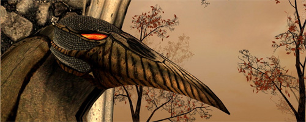

# Pathologic Game Research Project



Here I'm trying to reverse-engineer Pathologic game resource files and share my results with public

## Goals
- [x] Extract .VFS files
- [ ] Create GUI utility to extract and pack .VFS files
- [ ] Reverse-enginere `.mesh` files structure
- [ ] Create a model viewer

## Geometry.vfs

Contains 3D models data.

### .mesh file structure (NOT COMPLETE)
```
struct {
    unsigned int unknown1;
    if (unknown1 == 0) {
        unsigned int unknown2;
    }
    unsigned int unknown3;
    unsigned int unknown4;
    unsigned char unknown5;
    unsigned char string_length;
    char texture_name[string_length];
    char probably_null_terminator_but_maybe_alpha_flag;
    unsigned int vertices_count;
    unsigned int indices_count;

    char unknown_chunk[88]; // for inv_lemon.mesh
//       char unknown_chunk[93]; // for avrox_grave01.mesh
//       char unknown_chunk[93]; // for victoria.mesh
//       char unknown_chunk[804]; // for trash01.mesh
//       char unknown_chunk[3846]; // for Bench41.mesh
//       char unknown_chunk[93]; // for b6q01_bull.mesh
//       char unknown_chunk[161]; // for pond.mesh

    struct {
        short x;
        short y;
        short z;
        char padding[12];
    } vertices[vertices_count];
    struct {
        short v1;
        short v2;
        short v3;
    } indices[indices_count];
} mesh;
```
